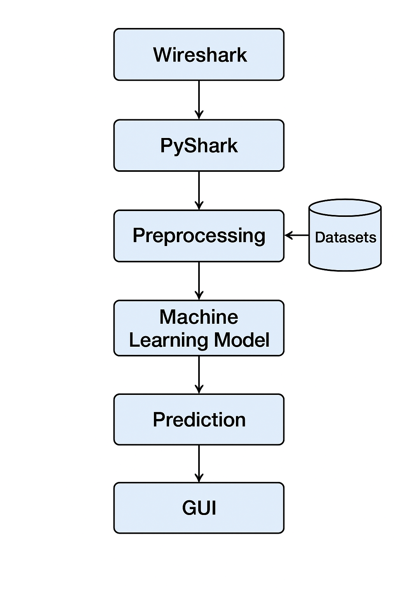
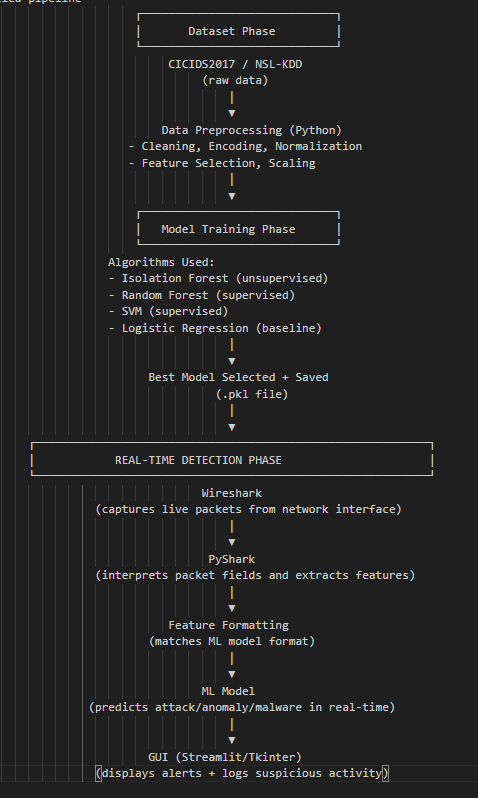

1. Overview

The system architecture is designed to capture real-time network packets, extract features, classify traffic using ML models, and present alerts through a user-friendly interface. It consists of four main components:

- Real-Time Packet Capture (Wireshark/PyShark)

- Feature Extraction Layer

- ML-Based Detection Engine

- GUI & Alert Visualization

2. Architecture Components

A. Real-Time Packet Capture Module

- Captures live packets from network interface

- Powered by Wireshark

- Python uses PyShark to access packet streams

B. Feature Extraction Layer

- Converts packets into flow-level features

- Extracts:

  - IP addresses

  - ports

  - protocol

  - packet count

  - byte count

  - duration

  - flags

C. Machine Learning Detection Layer

- ML models trained on CICIDS2017 + NSL-KDD

- Performs classification for:

  - benign

  - anomaly

  - malware-related behavior

D. GUI & Visualization

- Displays alerts in real-time

- Shows model confidence scores

- Shows flow-level stats

- Built using Streamlit or Tkinter

3. Data Flow Description

[ Live Network Traffic ] -->
          
[ Wireshark Packet Capture ] -->
          
[ PyShark Packet Parser ] -->
          
[ Feature Extraction Script ] -->
          
[ ML Model Inference (Real Time) ] -->
          
[ Alert Generator ] -->
          
[ GUI Dashboard ]

4. Logging & Audit Trail

- All detected events are stored

- Helps in testing, debugging, and performance evaluation

5. System architecture 

6. Detailed pipeline
                     