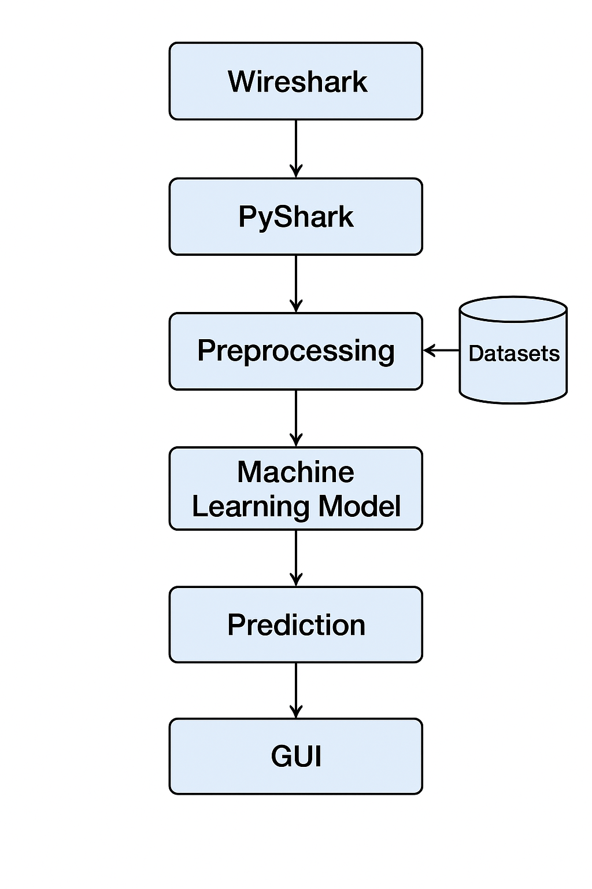

1. Overview

The system architecture is designed to capture real-time network packets, extract features, classify traffic using ML models, and present alerts through a user-friendly interface. It consists of four main components:

- Real-Time Packet Capture (Wireshark/PyShark)

- Feature Extraction Layer

- ML-Based Detection Engine

- GUI & Alert Visualization

2. Architecture Components

A. Real-Time Packet Capture Module

- Captures live packets from network interface

- Powered by Wireshark

- Python uses PyShark to access packet streams

B. Feature Extraction Layer

- Converts packets into flow-level features

- Extracts:

  - IP addresses

  - ports

  - protocol

  - packet count

  - byte count

  - duration

  - flags

C. Machine Learning Detection Layer

- ML models trained on CICIDS2017 + NSL-KDD

- Performs classification for:

  - benign

  - anomaly

  - malware-related behavior

D. GUI & Visualization

- Displays alerts in real-time

- Shows model confidence scores

- Shows flow-level stats

- Built using Streamlit or Tkinter

3. Data Flow Description

[ Live Network Traffic ]
          ↓
[ Wireshark Packet Capture ]
          ↓
[ PyShark Packet Parser ]
          ↓
[ Feature Extraction Script ]
          ↓
[ ML Model Inference (Real Time) ]
          ↓
[ Alert Generator ]
          ↓
[ GUI Dashboard ]

4. Logging & Audit Trail

- All detected events are stored

- Helps in testing, debugging, and performance evaluation

5. Reference to system architecture image

6. Detailed pipeline
                            ┌─────────────────────────────┐
                            │       Dataset Phase         │
                            └─────────────────────────────┘
                                 CICIDS2017 / NSL-KDD
                                      (raw data)
                                          │
                                          ▼
                                Data Preprocessing (Python)
                           - Cleaning, Encoding, Normalization
                           - Feature Selection, Scaling
                                          │
                                          ▼
                            ┌─────────────────────────────┐
                            │   Model Training Phase      │
                            └─────────────────────────────┘
                        Algorithms Used:
                        - Isolation Forest (unsupervised)
                        - Random Forest (supervised)
                        - SVM (supervised)
                        - Logistic Regression (baseline)
                                          │
                                          ▼
                              Best Model Selected + Saved
                                        (.pkl file)
                                          │
                                          ▼
            ┌───────────────────────────────────────────────────────────┐
            │            REAL-TIME DETECTION PHASE                      │
            └───────────────────────────────────────────────────────────┘
                                      Wireshark
                      (captures live packets from network interface) 
                                          │
                                          ▼
                                       PyShark
                      (interprets packet fields and extracts features)
                                          │
                                          ▼
                                 Feature Formatting 
                              (matches ML model format)
                                          │
                                          ▼
                                      ML Model
                     (predicts attack/anomaly/malware in real-time)
                                          │
                                          ▼
                              GUI (Streamlit/Tkinter) 
                      (displays alerts + logs suspicious activity)
